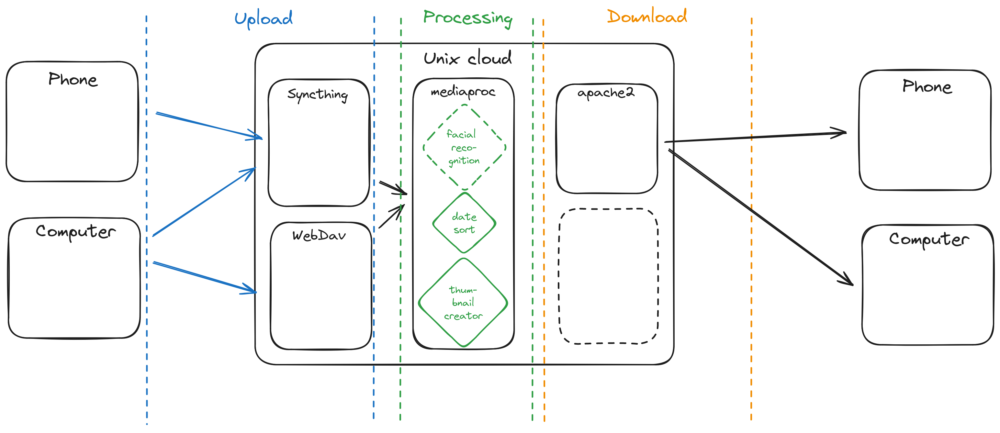

# `unixcloud` - A cloud service that follows UNIX philosophy.

`unixcloud` is a minimalist and versatile file cloud service. It strives to
follow [Unix philosophy](https://en.wikipedia.org/wiki/Unix_philosophy) and,
therefor, emphasize the use of existing specialized tools over reinventing the 
wheel.

## Overview

From a global perspective, `unixcloud` is a composable processing pipeline that
works on top of [unix filesystems](https://en.wikipedia.org/wiki/Unix_filesystem).

It is made of three major components:
* Upload: programs responsible of receiving files
([syncthing](https://syncthing.net/),
[webdav](https://en.wikipedia.org/wiki/WebDAV), etc).
* Processing: programs responsible of transforming files (thumbnail creation,
facial recognition, sorting files, etc).
* Download: programs responsible of serving files to client
([webdav](https://en.wikipedia.org/wiki/WebDAV)).

## Contributing

If you want to contribute to `unixcloud` to add a feature or improve the code contact
me at [negrel.dev@protonmail.com](mailto:negrel.dev@protonmail.com), open an
[issue](https://github.com/negrel/unixcloud/issues) or make a
[pull request](https://github.com/negrel/unixcloud/pulls).

## :stars: Show your support

Please give a :star: if this project helped you!

## :scroll: License

MIT © [Alexandre Negrel](https://www.negrel.dev/)
